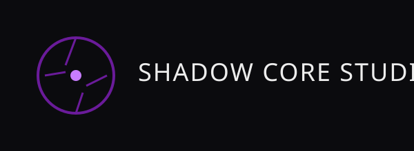

  
  [-blue?style=for-the-badge)](https://mrcode-10.github.io/my-awesome-site/)
  
  

  ---

  [🌐 Official Website](https://mrcode-10.github.io/my-awesome-site/) •
  [📺 YouTube Channel](https://www.youtube.com/@ShadowCoreStudio-i7r) •
  [🎵 TikTok](https://www.tiktok.com/@shadow.game.devel)

 

### 💻 Core Arsenal

### 🎮 Game & App Development

### 🎨 UI/UX & Video Editing

### 🔍 Explored & Familiar With (Side Quests!)

 

> *“Forged in C++, thriving in Unreal Engine, designing complete UI/UX & Databases, producing content, and continuously exploring new tech realms!”* 🚀✨

 

---

### 🎨 UI/UX Design & Database Architecture
- **UI/UX Design:** Designed end-to-end custom user interfaces in **Figma** for mobile applications.
- **Database Architecture:** Built and structured custom database schemas for all Android apps and web projects.
- **Content Creation & Video Editing:** Self-produced, recorded, and edited all video content for **YouTube** and **TikTok**.

---

### 📊 GitHub Activity & Stats

 

### 🐍 GitHub Contributions Snake

<picture>
  <source media="(prefers-color-scheme: dark)" srcset="https://raw.githubusercontent.com/MrCode-10/MrCode-10/output/github-snake-dark.svg">
  <source media="(prefers-color-scheme: light)" srcset="https://raw.githubusercontent.com/MrCode-10/MrCode-10/output/github-snake.svg">
  
</picture>

